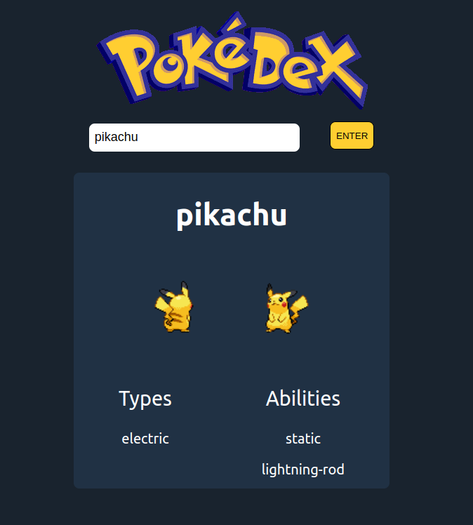

# Pokedex React

Pokedex autoral usando a Poke API (https://pokeapi.co/) feita para fins didáticos ao ministrar um treinamento de react no Processo de Treinamento por área do CITi em 2020.2.

Para utilizar, entre no link da descrição do projeto, digite o nome de qualquer pokemon e clique no botão "Enter".

